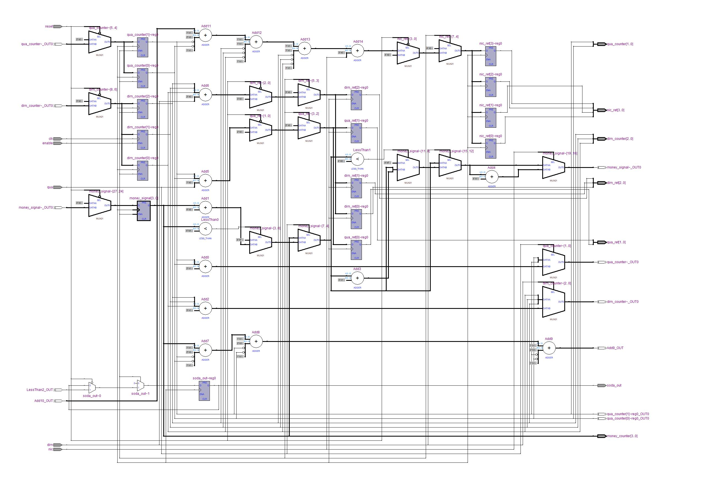
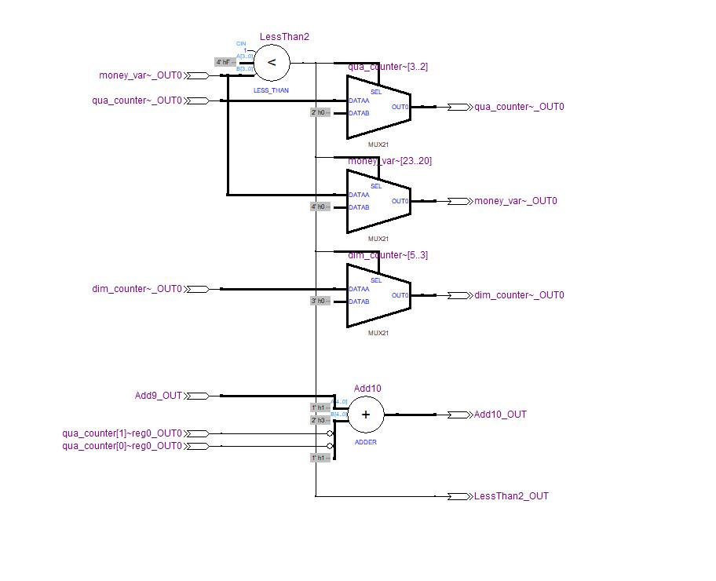
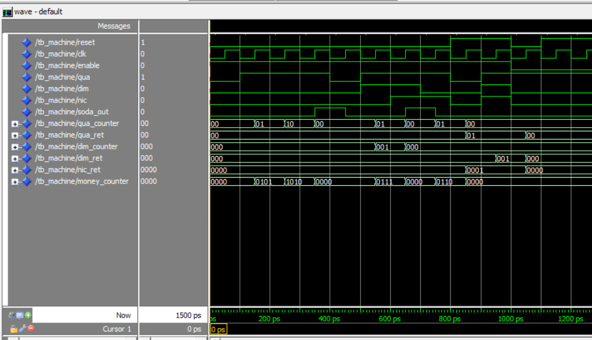

# Soda Vending Machine

## Aim
The purpose of this project is to design a electronic circuit of automatic soda vending machine

## Working
The machine accepts 3 types of coins, namely quarters, dimes and nickels. These coins are equivalent to 25 cents, 10 cents and 5 cents respectively. Each soda costs 75 cents, so to purchase one, the user must insert at least 75 cents into the vending machine. Enable must be 1 for money to be allowed inside the soda machine. The machine will not return any money inserted in excess than 75 cents. If the user resets the vending machine while purchasing soda, all the money already inserted and also the money inserted afterwards by the user will be returned back. 

## RTL View of Circuit

## Simulation Waveform

